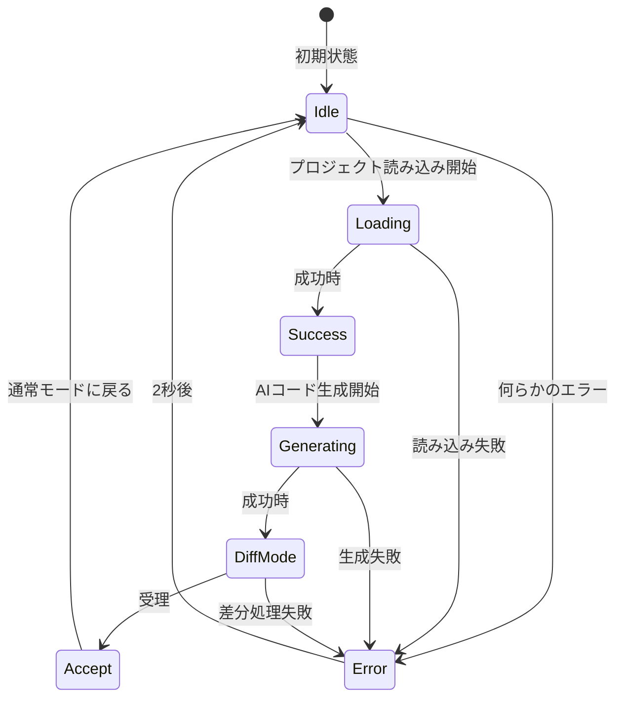
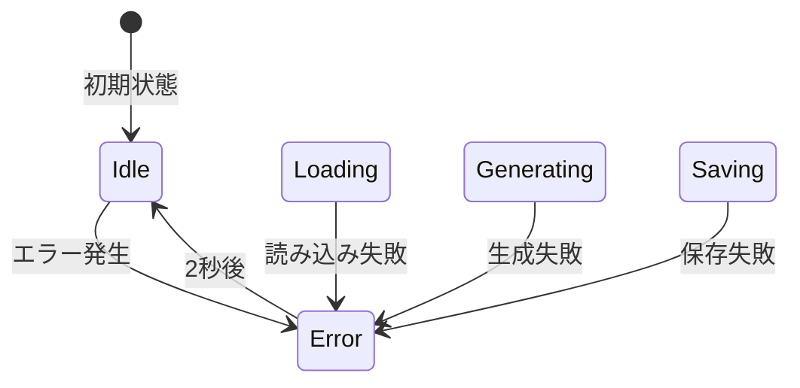
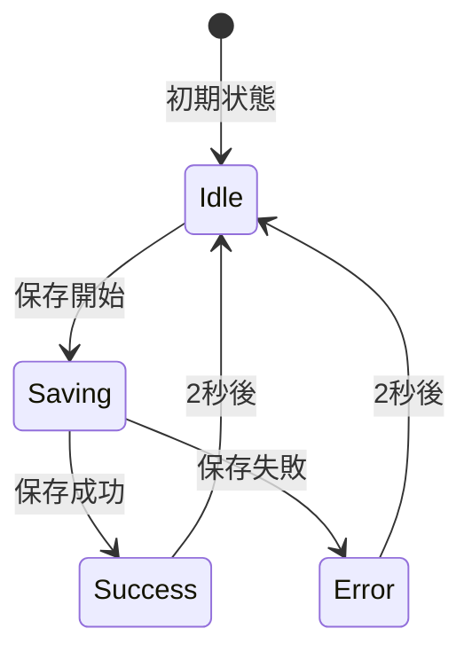
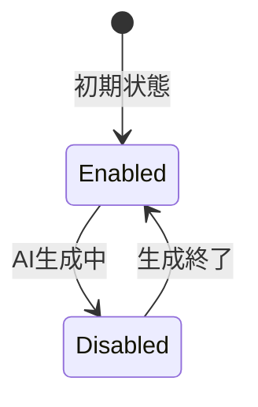
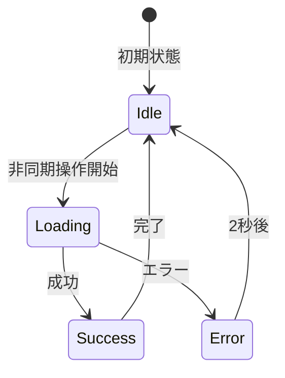
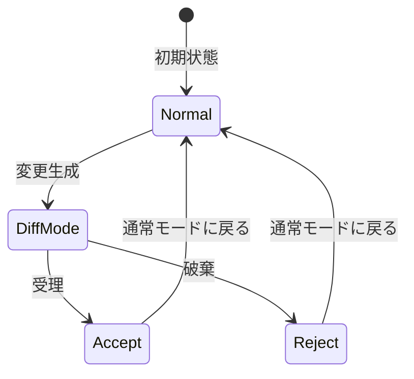

# GAS4U ステートマシン図

このドキュメントは、GAS4Uプロジェクトで実装されているステートマシンと状態遷移について説明します。

## 概要

GAS4Uプロジェクトでは、明示的なステートマシンライブラリ（XStateなど）は使用されていませんが、Reactの`useState`と`useEffect`を使用した一貫した状態管理が実装されています。主に非同期処理とUI状態の管理に使用されています。

## メインエディタコンポーネントの状態管理

### エディタ状態遷移図 (Mermaid)




### エラー状態遷移 (Mermaid)




**状態説明:**
- **Idle**: 待機状態。ユーザー操作を受け付けられる状態
- **Loading**: プロジェクトの読み込みや保存中
- **Generating**: AIコード生成中
- **DiffMode**: 生成されたコードの差分表示モード
- **Accept**: 変更を適用するプロセス
- **Error**: エラー発生状態（2秒後に自動的にIdleに戻る）

## ポップアップ設定コンポーネントの状態管理

### 設定保存状態遷移 (Mermaid)




**状態説明:**
- **Idle**: APIキー入力可能状態
- **Saving**: 設定保存中
- **Success**: 保存成功メッセージ表示
- **Error**: 保存失敗メッセージ表示

## プロンプト入力コンポーネントのUI状態

### プロンプト入力状態遷移 (Mermaid)




**状態説明:**
- **Enabled**: テキスト入力可能
- **Disabled**: AI生成中は入力不可、スピナー表示

## 非同期処理の一般的な状態遷移パターン

### 非同期処理状態遷移 (Mermaid)




## 差分表示モードの状態管理

### 差分表示状態遷移 (Mermaid)




**状態説明:**
- **Normal**: 通常のコード編集モード
- **DiffMode**: AI生成コードの差分を表示
- **Accept**: 差分を適用して通常モードに戻る
- **Reject**: 差分を破棄して通常モードに戻る

## 主な特徴

1. **明示的なステートマシンライブラリ未使用**: Reactの`useState`と`useEffect`で実装
2. **一貫した非同期パターン**: Loading → Success/Error → Idle
3. **UI状態とデータ状態の分離**: 表示状態と実際のデータ操作を明確に分ける
4. **自動復帰**: エラー状態は一定時間後に自動的にアイドル状態に戻る
5. **差分表示特化**: AI生成コードに対しては特別な差分表示モードが用意されている

## 実装ファイル

- `src/editor/index.tsx` - メインエディタの状態管理
- `src/popup/App.tsx` - 設定ポップアップの状態管理
- `src/components/PromptInput.tsx` - プロンプト入力のUI状態
- `src/lib/storage/manager.ts` - 永続化状態の管理
- `src/lib/clasp/manager.ts` - GASプロジェクト操作の状態遷移

## 非同期処理の標準パターン

```typescript
const handleAsyncOperation = async () => {
    // 1. ローディング状態開始
    setIsLoading(true);
    setError(null);

    try {
        // 2. API呼び出し
        const result = await someAsyncOperation();

        // 3. 成功時の状態更新
        setData(result);

    } catch (e) {
        // 4. エラー時の状態更新
        setError(e.message);

    } finally {
        // 5. ローディング状態終了
        setIsLoading(false);
    }
};
```

このパターンはプロジェクト全体で一貫して使用されています。